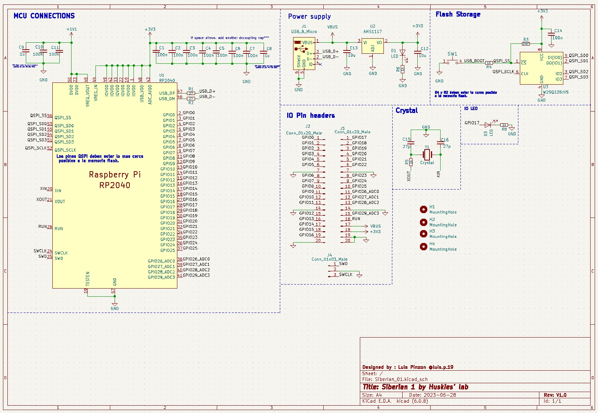
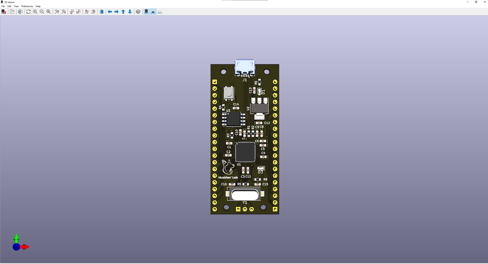
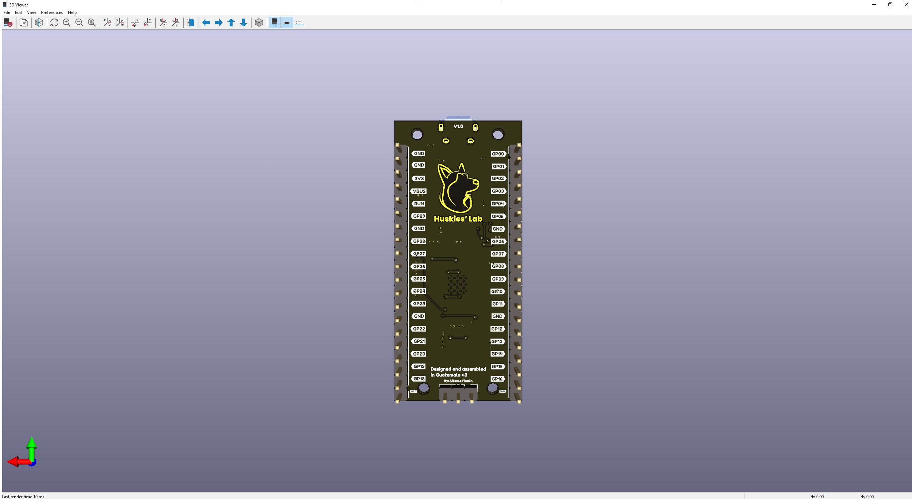

## Project Specification

[Link to the Github repository](https://github.com/luispa12/Siberian-01)

This board is based on the RP2040 microcontroller from the Raspberry Foundation.

### SoC Features

* Dual ARM Cortex-M0+ @ 133MHz
* 264kB on-chip SRAM in six independent banks
* Support for up to 16MB of off-chip Flash memory via dedicated QSPI bus
* DMA controller
* Fully-connected AHB crossbar
* Interpolator and integer divider peripherals
* On-chip programmable LDO to generate core voltage
* 2 on-chip PLLs to generate USB and core clocks
* 30 GPIO pins, 4 of which can be used as analog inputs
* Peripherals

&nbsp;

* 2 UARTs

&nbsp;

* 2 SPI controllers

&nbsp;

* 2 I2C controllers

&nbsp;

* 16 PWM channels

&nbsp;

* USB 1.1 controller and PHY, with host and device support

&nbsp;

   
* 8 PIO state machines

For the complete description of the microcontroller, see the [RP2040 DATASHEET](https://datasheets.raspberrypi.com/rp2040/rp2040-datasheet.pdf).

#### I2C Bus Connection

| Signal | GPIO   |
| ------ | ------ |
| SDA    | GPIO10 |
| SCL    | GPIO8  |

### Power

* USB Type B

### Pin Layout

#### Left Side

| Pin Number | Description  | SoC        |
| ---------- | ------------ | ---------- |
| 1          | Reset        | EN/CHIP_PU |
| 2          | 3V3          |            |
| 3          | N/C          |            |
| 4          | GND          |            |
| 5          | IO0/ADC1-0   | GPIO0      |
| 6          | IO1/ADC1-1   | GPIO1      |
| 7          | IO2/ADC1-2   | GPIO2      |
| 8          | IO3/ADC1-3   | GPIO3      |
| 9          | IO4/ADC2-0   | GPIO4      |
| 10         | IO5/ADC2-1   | GPIO5      |
| 11         | IO6/MTCK     | GPIO6      |
| 12         | IO7/MTDO/LED | GPIO7      |
| 13         | IO9/LOG      | GPIO8      |
| 14         | IO21/U0RXD   | GPIO21     |
| 15         | IO20/U0TXD   | GPIO20     |
| 16         | IO9/BOOT     | GPIO9      |

#### Right Side

| Pin Number | Description | SoC    |
| ---------- | ----------- | ------ |
| 1          | VBAT        |        |
| 2          | EN [1]      |        |
| 3          | VBUS [2]    |        |
| 4          | NC          |        |
| 5          | NC          |        |
| 6          | NC          |        |
| 7          | NC          |        |
| 8          | NC          |        |
| 9          | IO18/USB_D- | GPIO18 |
| 10         | IO19/USB_D+ | GPIO19 |
| 11         | IO8/SCL     | GPIO8  |
| 12         | IO10/SDA    | GPIO10 |

## Project KiCad Libraries

* [Libraries]()

## Board Design

Top

Bottom

## Bill of Material

[Interactive BOM](docs/bom/bom.html)
